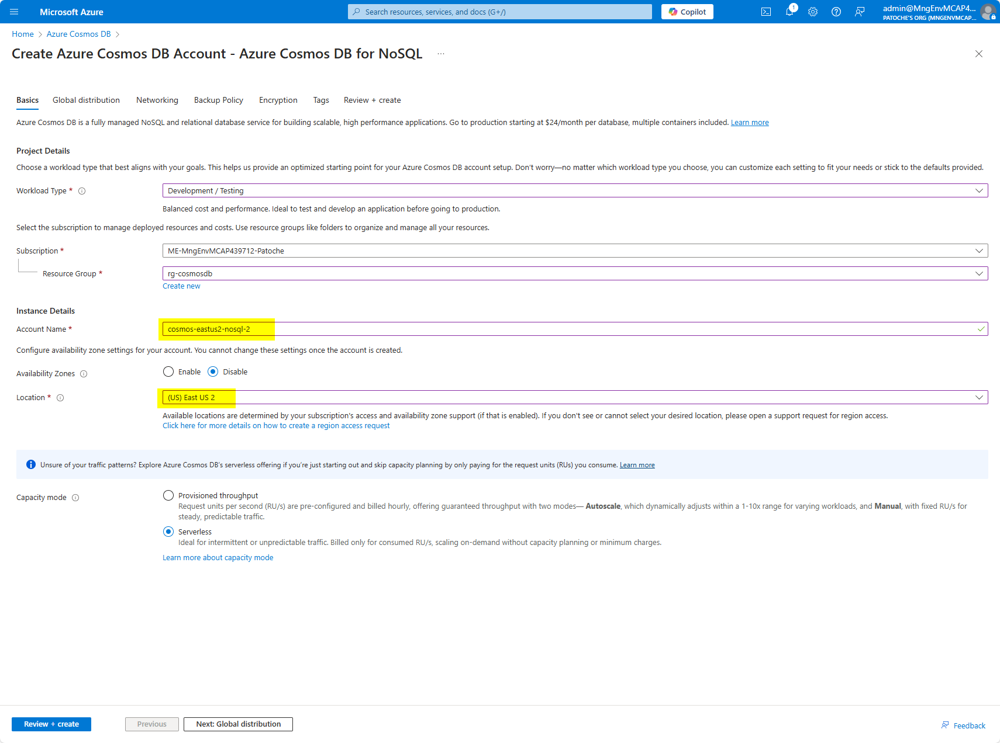
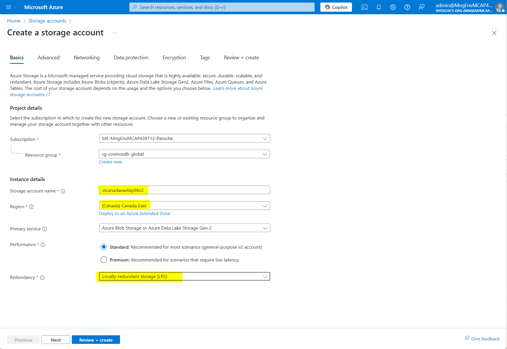

[](https://mseep.ai/app/patrice-truong-cosmosdb-mcp)

# Azure Cosmos DB MCP CLient & Server

This repository contains a project that shows how to create an MCP Server and client for Azure Cosmos DB. The project is divided into 2 parts:

- Frontend application: NextJS 15 application that displays a products catalog and features an AI Assistant that helps users to find products in the catalog and get past orders
- an MCP Server component, connected to the Azure Cosmos DB NoSQL database and responsible for reading products and orders from the database.


## Azure Architecture

- an Azure Cosmos DB NoSQL database that stores the product catalog
- a node.js server that serves as the MCP Server component


## References

- [Create an Azure Cosmos DB for NoSQL account](https://learn.microsoft.com/en-us/azure/cosmos-db/nosql/quickstart-portal)
- [Create an Azure Storage account](https://learn.microsoft.com/en-us/azure/storage/common/storage-account-create?tabs=azure-portal)
- [Create a Windows virtual machine](https://learn.microsoft.com/en-us/azure/virtual-machines/windows/quick-create-portal)
- [Windows execution policies](https://learn.microsoft.com/en-us/powershell/module/microsoft.powershell.security/set-executionpolicy?view=powershell-7.5)

## Step-by-step walkthrough

### Installation

**Azure Cosmos DB**

In the Azure portal, create an Azure Cosmos DB for NoSQL account.

- Give a unique name for your Azure Cosmos DB account. We will be using cosmos-eastus2-nosql-2 in the rest of this walkthrough.



- Click on "Next: Global distribution"


- Accept the default values and click on "Next: Networking"


- Accept the default values and click on "Next: Backup Policy"
- Select "Periodic" backup policy
- Select "Locally-redundant backup storage"


- Click on "Next: Encryption"


- Click on "Review and Create" to start validation


- Click on "Create" to start the creation of the Azure Cosmos DB for NoSQL account

For this project, you will need to enable vector support on the Azure Cosmos DB account.
- In the settings section, select Features, then "Vector Search for NoSQL API"

- In the panel that opens, click on the Enable button


- Create the Azure Cosmos DB eShop database and the Products container

- Click on "..." next to eShop to display the contextual menu and select "New container" to create the "carts" container in the eShop database.

Make sure that the partition key is **_"/id"_** (the partition key is case-sensitive)

Expand "Container Vector Policy" and click on the "Add vector embedding" button


- Create the carts container


**Storage account**

1. Create a storage account to store the product images

For more details, refer to the documentation: https://learn.microsoft.com/en-us/azure/storage/common/storage-account-create?tabs=azure-portal




**Install software pre-requisites **

1. Create a virtual machine in Azure or use your local computer
2. Install node.js v22.13.1 (LTS) from https://nodejs.org/en/download
3. Install Visual Studio Code x64 1.97.0 from https://code.visualstudio.com/download
4. Install Git 2.47.12 x64 from https://git-scm.com/downloads
5. Install .NET SDK x64 v9.0.102 from https://dotnet.microsoft.com/en-us/download/dotnet/thank-you/sdk-9.0.102-windows-x64-installer
6. Open a terminal window and add nuget source with

```sh
dotnet nuget add source https://api.nuget.org/v3/index.json -n nuget.org
```

7. If necessary, change PowerShell execution policies for Windows computers. Open a Powershell window **in administrator mode** and run this command

```sh
Set-ExecutionPolicy -ExecutionPolicy RemoteSigned -Scope CurrentUser
```

8. If necessary, install nuget, powershell, az cli and az modules

```sh
# install az cli
winget install -e --id Microsoft.AzureCLI

# install nuget and reference nuget source
Install-PackageProvider -Name NuGet -MinimumVersion 2.8.5.201 -Force

# update to latest Powershell release (7.5 as of writing)
winget install --id Microsoft.PowerShell --source winget

# install az modules
Install-Module -Name Az -Repository PSGallery -Force -AllowClobber
```

9. Open a terminal window and clone the repository:

```sh
git clone https://github.com/patrice-truong/cosmosdb-mcp.git
cd cosmosdb-mcp
```

10. Navigate to the nextjs folder and install dependencies

```sh
cd cosmosdb-mcp/nextjs
npm install  --legacy-peer-deps
```

11. In the nextjs folder, create and configure an .env file with the following values:

```sh
AZURE_COSMOSDB_NOSQL_ENDPOINT=https://<cosmosdb_account_name>.documents.azure.com:443/
AZURE_COSMOSDB_NOSQL_DATABASE=eshop
AZURE_COSMOSDB_NOSQL_PRODUCTS_CONTAINER=products
AZURE_COSMOSDB_NOSQL_CARTS_CONTAINER=carts
AZURE_COSMOSDB_NOSQL_ORDERS_CONTAINER=orders
AZURE_STORAGE_ACCOUNT_NAME=<storage_account_name>
AZURE_STORAGE_CONTAINER_NAME=<container_name>
```

12. Get your tenant ID. The tenant ID can be retrieved with this command:

```sh
az login
az account show --query tenantId -o tsv
```

13. In the webapi folder, configure the appsettings.json file and replace the tenant_id with the value obtained in the previous step:

```sh
{
  "CosmosDb": {
    "Endpoint": "https:/<cosmosdb_account_name>.documents.azure.com:443/",
    "TenantId": "<tenant_id>",
    "DatabaseName": "eshop",
    "ProductsContainerName": "products",
    "CartsContainerName": "carts",
    "OrdersContainerName": "orders"
  },
  "AzureBlobStorage": {
    "AccountName": "<storage_account_name>"
  }
}
```
14. Create an app registration in the Azure Portal
15. Create an app secret in the Azure Portal
16. You will need to allow your app to get access to Azure Cosmos DB. Retrieve the 4 ids mentioned below and modify the file "populate/set_rbac.ps1".

| Variable                     | Reference                                         |
| ---------------------------- | ------------------------------------------------- |
| Subscription Id              | Cosmos DB > Overview > Subscription Id            |
| Azure Cosmos DB account name | cosmos-eastus2-nosql-2                   |
| Resource group name          | Cosmos DB > Overview > Resource group name        |
| Principal Id                 | App registration Object Id |

```sh
$SubscriptionId = "<subscription-id>"   # Azure subscription id
$AccountName = "<cosmosdb-account-name>"    # cosmos db account name
$ResourceGroupName = "<resource-group-name>" # resource group name of the Cosmos DB account
$PrincipalId = "<principal-id>"   # object id of the app registered in Entra ID
```

17. Open a Powershell prompt, run Connect-AzAccount and execute ./set_rbac.ps1


18. Allow your app (or virtual machine) to access the storage account

- In the Azure portal, goto your storage account
- Select Access Control (IAM) in the menu


- Click on "Add role assignment"
- In the filter textbox, type "Storage Blob Data Contributor"


- Click on "Members"
- Select the name of your application


- Click on the "Select" button
- Click on "Review and assign"


19. Create a container and copy the content of the "azure-storage" folder to your storage account


20. Build webapi backend project with dotnet build

```sh
cd webapi
dotnet build
```

 18. On your secondary region VM (Australia East), modify the .env file with the IP address of the socket server in your primary region (East US 2)


19. There is no authentication built into this project. The user email is hard-coded in /nextjs/models/constants.ts. Change it to suit your demo needs


19. In mcp-server and nextjs folders, copy .env.template to .env and modify the values to suit your demo needs

```json
AZURE_COSMOSDB_NOSQL_ENDPOINT=https://<cosmosdb_account>.documents.azure.com:443/
AZURE_COSMOSDB_NOSQL_DATABASE=eshop
AZURE_COSMOSDB_NOSQL_PRODUCTS_CONTAINER=products
AZURE_COSMOSDB_NOSQL_CARTS_CONTAINER=carts
AZURE_COSMOSDB_NOSQL_ORDERS_CONTAINER=orders

NEXT_PUBLIC_AZURE_TENANT_ID=<tenant_id>
NEXT_PUBLIC_AZURE_CLIENT_ID=<client_id>
NEXT_PUBLIC_AZURE_CLIENT_SECRET=<client_secret>

NEXT_PUBLIC_AZURE_STORAGE_ACCOUNT_NAME=<storage_account_name>
NEXT_PUBLIC_AZURE_STORAGE_CONTAINER_NAME=img

AZURE_OPENAI_ENDPOINT=https://<azure_openai_account>.openai.azure.com/
AZURE_OPENAI_API_KEY=<azure_openai_key>
AZURE_OPENAI_EMBEDDING_MODEL=text-embedding-3-small
AZURE_OPENAI_API_VERSION=2024-05-01-preview
```

20. Build nextjs frontend project

```sh
cd nextjs
npm run build
```


## Populate the products catalog

In this section, we'll read the products catalog from the populate/catalog.json file and populate the Azure Cosmos DB for NoSQL database

1. Modify appsettings.json with your cosmosdb account name and 

```json
{
  "CosmosDb": {
    "Endpoint": "https://<cosmosdb_account_name>.documents.azure.com:443/",
    "TenantId": "<tenant_id>",
    "DatabaseName": "eshop",
    "ProductsContainerName": "products",
    "OrdersContainerName": "orders",
  }
}
```

2. Open a terminal window, navigate to the populate folder, execute az login, then dotnet run


3. Verify that the Azure Cosmos DB container has been properly populated


## Demo script

**Demo initialization:**

3. On your development computer, start the mcp server

```sh
cd mcp-server
npx ts-node src/server.ts
```

3. Start the front end project

- NextJS front end (store front)
  - cd nextjs
  - npm start

4. Optionally, open a command prompt and start the MCP inspector with this command:
npx -y @modelcontextprotocol/inspector


**Demo steps:**

1. Navigate to http://localhost:3002. 
2. 
2. Click on AI Assistant icon in the top right corner
3. Enter "I'm interested in backpacks" (the list of product refreshes with a list of backpacks)
4. Enter "Get my orders" (the list of orders refreshes with a list of orders)


